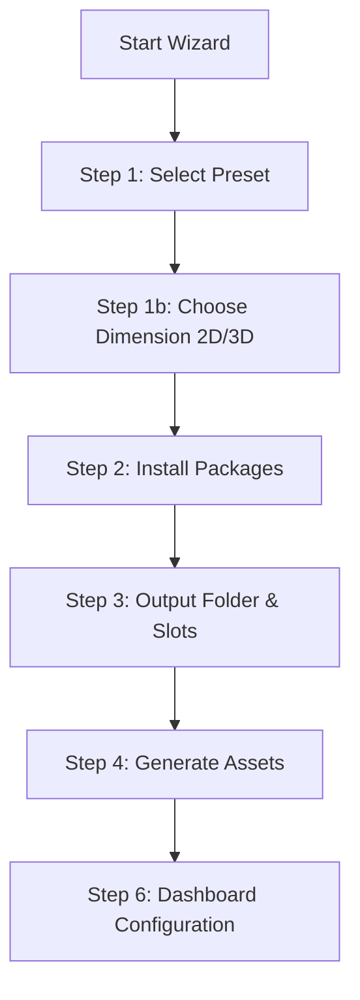

# Comprehensive Tutorial — Main Menu Setup Wizard Package

Learn how to distribute, install, configure, and customize the Main Menu Setup Wizard package in your Unity projects.

---

## 1. Package Installation (Git URL)

To import the wizard into any new or existing Unity project via the **Unity Package Manager (UPM)**:

1. Open your Unity project.
2. In the top menu bar, navigate to **`Window` → `Package Manager`**.
3. Click the **`+`** (plus) icon in the top-left corner of the Package Manager window.
4. Select **`Add package from git URL...`**.
5. Paste your repository's Git URL:
   `https://github.com/cvam33/mainmenu-setup.git`
6. Click **`Add`**. Unity will download, compile, and load the package automatically.

---

## 2. Generating a Main Menu

Once the package is installed, you can generate a complete main menu system in seconds:



1. Navigate to **`Tools` → `Main Menu Wizard`** to open the setup window.
2. **Step 1 — Choose Preset:** Select the gameplay preset that fits your project (e.g., *Single Player*, *Online Multiplayer*, *VR / XR*, *Mobile*).
3. **Step 1b — Choose Dimension:** Select **2D Dimension** (URP 2D Renderer + Cinemachine 2D Camera) or **3D Dimension** (URP Lit Renderer + Cinemachine Brain).
4. **Step 2 — Required Packages:** The wizard automatically verifies whether the required Unity packages are installed. Click **`Install Missing Packages`** if any are missing.
5. **Step 3 — Review Options:** Specify the number of save slots (for Single Player/Mobile) and set your target **Output Folder** (default is `Assets/MainMenu1`).
6. **Step 4 — Generation:** Click **`Generate`**. The wizard will compile the scripts, generate UXML/USS files, create the scene at `Assets/MainMenu1/Scenes/MainMenu.unity`, and add it to your Build Settings.
7. Click **`Open MainMenu Scene & Manage`** to load the scene.

---

## 3. Configuring Controls (Controls Config)

The wizard includes a configuration tab to map input actions directly inside the Unity Editor:

1. Switch to the **`CONTROLS`** tab on the Dashboard (Step 6).
2. Ensure you have linked your **`Custom Input Actions`** asset in the **`OVERVIEW`** tab.
3. Under **Keyboard Controls** and **Controller Controls**, click **`+ Add Control`** to add a binding.
4. Set a **Display Name** (e.g., `Jump`) and choose the corresponding Input Action path from the dropdown (e.g., `Player/Jump`).
5. **Interactive Rebinding:** Click on any binding slot button to activate rebind mode. Press any key or gamepad button to map it instantly.
6. Click **`Save Changes`** to save these configurations directly into the scene's `SettingsManager` component.

---

## 4. Configuring Audio (Sound Config)

Set up main menu music and dynamic UI audio event hookups in the **`SOUND`** tab:

1. Switch to the **`SOUND`** tab on the Dashboard.
2. **Background Music Playlist:**
   - Click **`+ Add Music Track`** to add background tracks.
   - Drag and drop audio clips into the track slots.
   - Toggle **`Loop Playlist`** to loop the tracks sequentially.
   - Adjust the **`Music Volume`** slider to set the default playlist volume.
3. **UI SFX Configuration:**
   - Drag and drop audio clips for **Click SFX**, **Toggle SFX**, **Panel SFX**, and **Navigate SFX**.
   - Adjust independent volume sliders for each SFX type.
4. Click **`Save Changes`** to attach and populate the `AudioManager` component on `MainMenuRoot` in the active scene.

> [!TIP]
> **Dynamic SFX Hookups:** The `AudioManager` automatically scans your UI Toolkit visual tree at runtime. Hovering focusable elements will automatically play the **Navigate SFX**, clicking buttons plays the **Click SFX**, and switching settings values plays **Toggle SFX**—requiring zero code from you.

---

## 5. Subclassing & Extensibility (Best Practices)

Since the wizard generates raw source files in your `Assets/` directory, you have full customization access. To extend or modify generated behaviors:

### Example: Customizing MainMenuManager
If you want to add custom button behaviors without breaking the wizard settings:
1. Create a new script in your project named `MyGameMenuManager.cs`.
2. Inherit from `MainMenuManager` and override virtual methods:

```csharp
using UnityEngine;

public class MyGameMenuManager : MainMenuManager
{
    protected override void Start()
    {
        base.Start();
        Debug.Log("Custom main menu initialized!");
    }

    // Example overriding play click
    private void OnPlayClicked()
    {
        Debug.Log("Showing level select instead of loading directly...");
        PanelManager.Instance.PushPanel("level-select-panel");
    }
}
```

---
